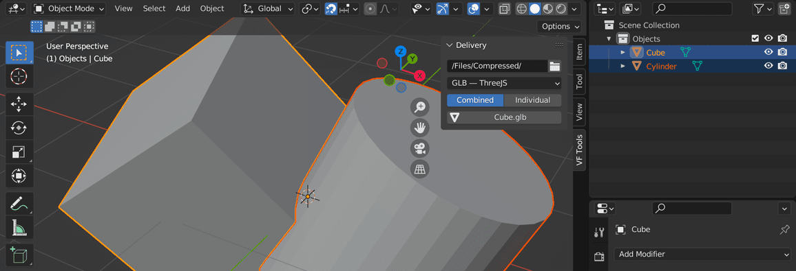

# VF Delivery

Export shortcuts for specific production pipelines. Supports Unity 3D (FBX), ThreeJS (compressed GLB) 3D printing (STL with multi-object output), and data visualisation (CSV position data).

## Installation and Usage
- Download [VF_delivery.py](https://raw.githubusercontent.com/jeinselenVF/VF-BlenderDelivery/main/VF_delivery.py)
- Open Blender Preferences and navigate to the "Add-ons" tab
- Install and enable the Add-on
- It will show up in the 3D view `VF Tools` tab
- Select one or more objects to export, or a collection to export the contents
- Choose one of the presets and export

## Settings

- `Delivery Location`
	- Folder where all exported files will be saved
	- **WARNING** — Files with the same name will be automatically overwritten

- `Pipeline`
	- `FBX — Unity3D` implements settings ideal for use in Unity3D
	- `GLB — ThreeJS` outputs files designed for use in ThreeJS (note that compressed GLB files are great for download optimisation, but are poorly supported in many apps)
	- `OBJ - Element3D` formats OBJ outputs for compatibility with VideoCopilot's Element 3D
	- `USDZ - Xcode` creates zipped USD files for use with Apple platforms such as Xcode development
	  - Textures must be in [PNG or JPG format](https://openusd.org/release/spec_usdz.html)
	- `STL — Printer` creates an individually named STL file for each selected object or each object within the selected collection
	- `CSV - Position` samples every frame within the scene rendering range and saves the position values to a plain text file in comma separated value format
- Available options are different for mesh (FBX, GLB, etcetera) and data (CSV) export types
	- `Grouping` determines how multiple selections are handled for all mesh export types (not applicable to CSV data)
		- `Combined` exports all selected mesh objects into a single file with the output name determined by the active object (active object doesn't have to be a mesh, and will not be included in the export)
		- `	Individual` exports each selected mesh object as an individually named file

	- `Position` defines the world or local space of the exported data (exclusive to CSV data)
		- `World` exports each frame of position data in world space (parent position and animation will be fully accounted for)
		- `Local` exports each frame of position data in local object space (parent position and animation is irrelelvant)

- `Export`
	- The export button will update as objects or collections are selected, reflecting the name that will be used in the export file(s)
		- If one or more objects are selected, the active object will be used as the file name
		- If no objects are selected, the active collection will be exported, and the collection name will be used as the file name
		- For STL exports, separate files will be created for each selected object
		- For CSV exports, only one file can be exported at a time, and it's the active object that will be used as data source

## Known Limitations

- All selected `curve`, `mesh`, `metaball`, `surface`, and `text` objects will be included by default, but not all exporters support them to the same extent:
	- `ABC` format (though not included in the latest relase) will export `mesh` and `metaball` objects as meshes, while `curve` objects will only include the original curve (regardless of extrusion, bevel, or geometry nodes based conversion to a mesh), and `surface` and `text` objects will only be included as empty locators
	- `FBX` exports all elements as meshes, including converting non-meshed curves into point arrays using the curve sampling resolution (the line itself is lost, only the positions along that line are preserved)
	- `GLB` will export `curve` (if extruded or beveled), `mesh`, `surface`, and `text` objects as meshes, but non-mesh `curve` objects, `curve` objects that are converted to mesh objects via geometry nodes, and `metaball` objects will be included only as empty locators
	- `OBJ` exports all elements as meshes, except for `curve` objects without any mesh component (no extrusion, bevel, or geometry nodes conversion to a mesh) which are ignored entirely (the OBJ format doesn't support empty locators)
	- `USDZ` files haven't been fully tested yet
	- `STL` like the OBJ format, this exports all elements as meshes except for non-meshed curves (curve objects without any extrusion, bevel, or geometry nodes conversion to a mesh)
	- Because there may be situations where empty locators or ignoring unsupported elements may be the preferred result, no warning will be given for "unsupported" combinations of object type and export format
- Experimental conversion of Geometry Nodes named attributes into UV maps was a hacky workaround for versions of Blender prior to 3.5.x, and has been removed thanks to the gradual addition of native 2D Vector and UV support in Geometry Nodes
	- Using the `Store Attribute` node with a `2D Vector` data type, `Face Corner` domain, and `UVMap` attribute name will successfully export a UV map (tested with FBX, GLB, and OBJ formats)
	- As of Blender 3.5.0, using an Output Attribute with `Vector` data type, `Face Corner` domain, and setting the output field to `UVMap` in the modifier panel _does not work_ (tested with FBX, GLB, and OBJ formats)
- There are no plans to add significant customisation to the exports. This plugin is designed for specific pipelines at Vectorform, and if it doesn't fit your use case, the best option is to fork the project and make it your own
- This software is provided without guarantee of usability or safety, use at your own risk